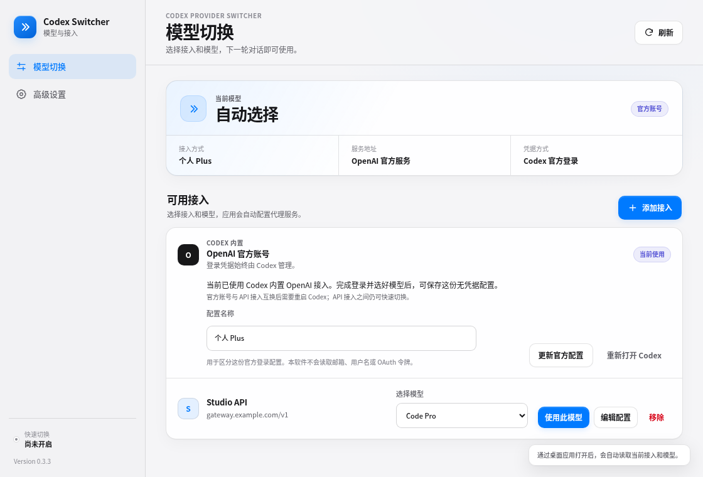
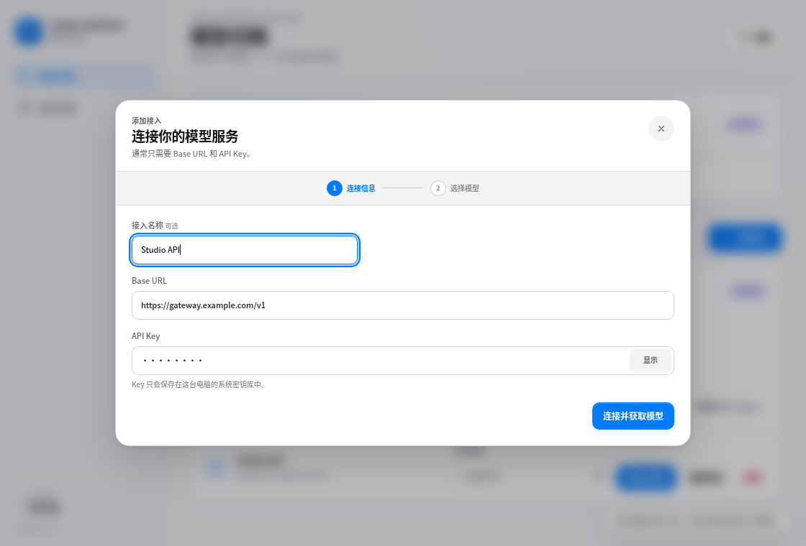
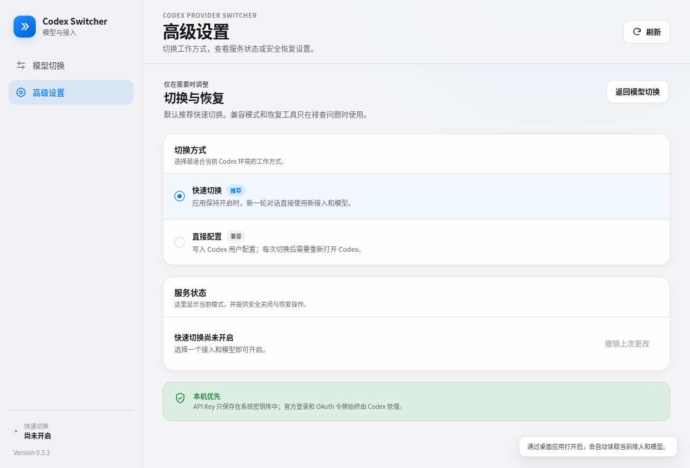

<p align="center">
  
</p>

<h1 align="center">Codex Provider Switcher</h1>

<p align="center">
  不改 TOML，也能安全切换 Codex 的模型服务与模型。
  <br>
  A focused, unofficial provider and model switcher for Codex on Windows and macOS.
</p>

<p align="center">
  <a href="https://github.com/grey0758/codex-provider-switcher/releases/tag/v0.3.3"><strong>下载 v0.3.3 预览版</strong></a>
  ·
  <a href="#三步开始使用">使用指南</a>
  ·
  <a href="#安全边界">安全说明</a>
  ·
  <a href="docs/release.md">发布状态</a>
</p>

<p align="center">
  <a href="https://github.com/grey0758/codex-provider-switcher/actions/workflows/quality.yml">
    
  </a>
  
  
  
</p>



Codex Provider Switcher 是一个独立、干净实现的 Tauri 桌面伴侣。它会在启动时
读取当前 Codex 接入与模型，让你通过图形界面添加 OpenAI
Responses-compatible 服务、保存常用模型，并在之后一键切换。

## 它解决什么

| 简单切换 | 凭据留在本机 | 可恢复 |
| --- | --- | --- |
| 输入 Base URL 与 API Key，自动获取模型，不必手改 `config.toml`。 | API Key 只进入 macOS Keychain 或 Windows Credential Manager；保存的接入不含 Key。 | 第一次启用快速切换前创建恢复点；关闭时校验并恢复，不覆盖无关配置。 |

- **快速切换是默认模式。** 第一次启用可能需要完整重开一次 Codex；之后保持
  Switcher 运行，选择的接入和模型会在下一轮对话生效。
- **官方 ChatGPT 登录仍由 Codex 管理。** Switcher 只恢复内置 `openai`
  路由，不读取、复制或改写 `auth.json` 与 OAuth 令牌。
- **不修改 Codex 安装包。** 不补丁 `app.asar`，不替换签名后的 Codex
  Desktop，也不会擅自生成 `model_catalog_json`。

## 下载与安装

> 0.3.3 是内部预览版。Windows 安装包尚未代码签名；macOS 包使用 ad-hoc
> 签名，但尚未 Developer ID 签名或公证。安装前请核对 Release 中的
> `SHA256SUMS.txt`。

| 系统 | 安装包 | 安装方法 |
| --- | --- | --- |
| Windows x64（已在 Windows 11 验证） | [下载 EXE](https://github.com/grey0758/codex-provider-switcher/releases/download/v0.3.3/Codex.Provider.Switcher_0.3.3_Windows-x64-Setup.exe) | 双击安装；若 SmartScreen 出现，核对校验值后选择“更多信息 → 仍要运行” |
| Apple silicon Mac | [下载 arm64 DMG](https://github.com/grey0758/codex-provider-switcher/releases/download/v0.3.3/Codex.Provider.Switcher_0.3.3_macOS-arm64.dmg) | 打开 DMG，把应用拖到 Applications |
| Intel Mac | [下载 x64 DMG](https://github.com/grey0758/codex-provider-switcher/releases/download/v0.3.3/Codex.Provider.Switcher_0.3.3_macOS-x64.dmg) | 打开 DMG，把应用拖到 Applications |

这个仓库目前是**桌面应用**，支持 Windows 与 macOS。它需要访问当前用户的
Codex Desktop 配置和系统凭据库，因此不支持 iPhone/iPad，也没有可安装的 iOS
版本。

<details>
<summary><strong>macOS 第一次打开提示“无法验证开发者”</strong></summary>

0.3.3 预览包尚未完成 Apple 公证。确认 Release 校验值后，打开
**系统设置 → 隐私与安全性**，在安全提示旁选择**仍要打开**。公开发布前仍需
Developer ID 签名和公证。

</details>

<details>
<summary><strong>如何核对 SHA-256</strong></summary>

Windows PowerShell：

```powershell
Get-FileHash '.\Codex.Provider.Switcher_0.3.3_Windows-x64-Setup.exe' -Algorithm SHA256
```

macOS：

```bash
shasum -a 256 Codex.Provider.Switcher_0.3.3_macOS-arm64.dmg
```

将结果与同一 Release 中的 `SHA256SUMS.txt` 对比。

</details>

## 三步开始使用

### 1. 打开应用，确认当前状态

Switcher 会自动显示当前模型、接入方式、服务地址和非敏感凭据方式。这里不会
展示官方 OAuth 令牌，也不会把 API Key 写进 Codex 配置。

首次使用时，主页面的“快速切换”会显示为尚未开启，这是正常状态。

### 2. 添加模型服务

点击**添加接入**，依次完成：

1. 填写一个便于识别的接入名称。
2. 输入完整 Base URL，例如 `https://api.example.com/v1`。
3. 输入 API Key，点击**连接并获取模型**。
4. 勾选需要保留的模型；服务不提供模型列表时，可以手动输入模型 ID。
5. 选择**仅保存**或**保存并使用**。



模型发现会优先尝试 `/v1/models`，再尝试 `/models`。远程服务必须使用
HTTPS；模型列表限制为 2 MiB 和 500 个模型，连接不会跟随重定向。

### 3. 选择接入和模型

回到模型切换页，在保存的接入中选择模型并点击**使用此模型**：

- 第一次启用快速切换时，应用会配置仅限本机访问的认证服务，并提示完整退出和
  重开一次 Codex。
- 启用后，API 接入或模型的变化会应用到下一轮对话。
- 更换不同服务时建议新建 Codex 对话；不同服务之间不保证隐藏上下文兼容。
- Switcher 可以缩到系统托盘。快速切换开启时需要保持应用运行。

## 使用 Codex 官方账号

1. 在**OpenAI 官方账号**卡片中选择切换/更新官方配置。
2. Switcher 会先安全关闭本机代理，再恢复 Codex 内置 `openai` 路由。
3. 完整重开 Codex，并在 Codex 自己的界面完成 ChatGPT 登录。
4. 返回 Switcher，为这份无凭据配置设置名称并保存。

只有一份 Codex 官方登录缓存。保存的名称是方便识别的书签，不代表多个彼此
独立绑定的官方账号。

## 高级设置与恢复

普通使用无需进入高级设置。这里提供：

- **快速切换（推荐）**：首次配置后，下一轮对话可直接使用新接入或模型。
- **直接配置（兼容）**：直接写入上游 provider/model，每次切换后都要重开
  Codex 并开始新对话。
- **服务状态**：查看快速切换是否运行，以及是否需要安全恢复。
- **恢复工具**：仅在配置校验通过时撤销 Switcher 管理的更改。



## 安全边界

- API Key 与本机代理入口令牌存放在操作系统凭据库；`profiles.json` 和
  `proxy.json` 不保存这些令牌。
- 官方登录由 Codex 持有和刷新；Switcher 不读取、导出或改写 Codex OAuth
  数据。
- 所有 Codex 配置写入都基于内容哈希、原子替换和精确备份。
- 快速切换只监听本机回环地址，并使用独立随机令牌认证 Codex 的本机请求。
- 不跟随上游重定向，不自动重试请求，并移除传入的认证与 hop-by-hop headers。
- 不了解的 Codex Desktop 构建会 fail closed；当前没有启用渲染器注入。

更完整的边界见 [安全模型](docs/security.md) 与
[架构说明](docs/architecture.md)。

## 常见问题

<details>
<summary><strong>切换后为什么 Codex 还在使用旧模型？</strong></summary>

首次启用快速切换、切换到官方账号，或使用“直接配置”时，需要完整退出并重开
Codex。快速切换已经运行时，普通 API 模型切换会从下一轮对话开始生效。

</details>

<details>
<summary><strong>为什么获取不到模型列表？</strong></summary>

检查 Base URL、网络与 API Key 是否正确。若服务不提供标准 `/v1/models` 或
`/models` 响应，可在编辑器第二步手动添加模型 ID。

</details>

<details>
<summary><strong>关闭窗口后快速切换会停止吗？</strong></summary>

不会。快速切换启用时，关闭主窗口会保留托盘进程；从托盘选择退出会结束应用，
但不会擅自改写已保存的恢复状态。下次启动会重新读取并恢复已选路由。

</details>

<details>
<summary><strong>这是 OpenAI 官方软件或 Codex 插件吗？</strong></summary>

不是。它是一个独立的非官方桌面伴侣，不受 OpenAI 赞助、认可或支持。

</details>

## 开发与验证

需要 Node.js 22+、pnpm 10+、Rust 1.97.1，以及当前系统对应的 Tauri 2
构建依赖。

```bash
pnpm install --frozen-lockfile
pnpm check
pnpm test
pnpm web:build
cargo fmt --all -- --check
cargo test --locked \
  -p codex-provider-switcher-core \
  -p codex-provider-switcher-credentials \
  -p codex-provider-switcher-launcher \
  -p codex-provider-switcher-local-proxy \
  -p codex-provider-switcher-desktop
pnpm tauri dev
```

推送 `v*.*.*` 标签会启动 [.github/workflows/release.yml](.github/workflows/release.yml)：
在 Windows x64、Apple silicon macOS 和 Intel macOS 上运行原生测试、构建安装包、
完成安装/移除 smoke test，生成 SHA-256 校验文件，再创建 GitHub prerelease。

更改集成行为前请阅读：

- [界面设计](docs/interface-design.md)
- [架构](docs/architecture.md)
- [兼容性](docs/compatibility.md)
- [发布门槛](docs/release.md)
- [安全模型](docs/security.md)

CC Switch 仅作为 MIT 许可的可观察行为参考。本仓库没有包装或复制 CC Switch
源码和素材；详见 [NOTICE.md](NOTICE.md)。

## License

[MIT](LICENSE)

Codex 与 OpenAI 是其各自所有者的商标。本项目与 OpenAI 无隶属关系。
